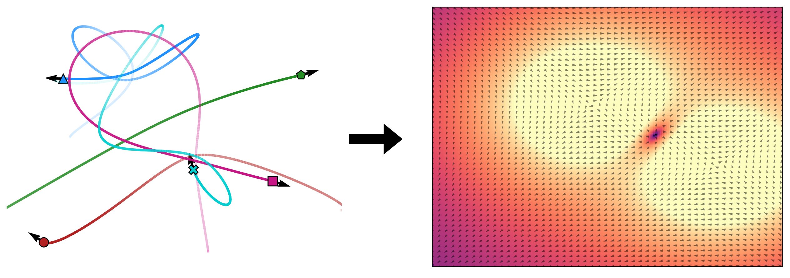

# Aether

> :scroll: We term our method Aether, inspired by the postulated medium that permeates all
> throughout space and allows for the propagation of light. :dash: :ocean: :rock: :fire:

Official source code for

<pre>
<b>Latent Field Discovery in Interacting Dynamical Systems with Neural Fields</b>
<a href="https://mkofinas.github.io/">Miltiadis Kofinas</a>, <a href="https://ebekkers.github.io/">Erik J Bekkers</a>, <a href="https://menaveenshankar.github.io/">Naveen Shankar Nagaraja</a>, <a href="https://egavves.com/">Efstratios Gavves</a>
<em>NeurIPS 2023</em>
<a href="https://arxiv.org/abs/2310.20679">https://arxiv.org/abs/2310.20679</a>
</pre>



[](https://arxiv.org/abs/2310.20679)
[](https://doi.org/10.5281/zenodo.10631646)
[](https://doi.org/10.5281/zenodo.10634923)

__TL;DR__: We discover global fields in interacting systems, inferring them from the dynamics alone, using neural fields.

For a reference implementation of Aether, see [here](nn/state2state/aether.py).

## Setup
Create a new conda environment and install dependencies:
```
conda create -n aether python=3.9
conda activate aether
conda install pytorch==2.0.1 torchvision torchaudio pytorch-cuda=11.8 -c pytorch -c nvidia
conda install pyg pytorch-scatter -c pyg
pip install plotly tensorboard matplotlib pandas
```

Then, download the repo and install it:
```
git clone https://https://github.com/mkofinas/aether.git
cd aether
pip install -e .
```

## Experiments

To run a specific experiment, please follow the README file within its corresponding experiment directory.
It provides full instructions and details for downloading/generating the data and reproducing the results reported in the paper.

- Electrostatic field: [`experiments/electrostatic`](experiments/electrostatic)
- Lorentz force field: [`experiments/lorentz`](experiments/lorentz)
- Traffic scenes (inD): [`experiments/ind`](experiments/ind)
- Gravitational field: [`experiments/gravitational`](experiments/gravitational)

### Scripts

The `scripts` directory contains scripts for running experiments for the electrostatic
field setting, the traffic scenes, and the gravitational field. From the root directory,
you can run the following:

- `./scripts/electrostatic_field_aether.sh`
- `./scripts/ind_aether.sh`
- `./scripts/gravitational_field_3d_aether.sh`

Each script will train a model, evaluate it, save results, and (in the case of Aether)
visualize the discovered field(s).
You can also find scripts for other baseline models in the `scripts` directory.


#### Attribution

Our codebase is based on the code from the papers:
- [__LoCS__](https://arxiv.org/abs/2110.14961), https://github.com/mkofinas/locs
- [__dNRI__](https://openaccess.thecvf.com/content_CVPR_2020/papers/Graber_Dynamic_Neural_Relational_Inference_CVPR_2020_paper.pdf), https://github.com/cgraber/cvpr_dNRI
- [__NRI__](https://arxiv.org/pdf/1802.04687.pdf), https://github.com/ethanfetaya/NRI
- [__ClofNet__](https://arxiv.org/abs/2110.14811), https://github.com/mouthful/ClofNet
- [__EGNN__](https://arxiv.org/abs/2102.09844), https://github.com/vgsatorras/egnn

## Citation

If you find our work or this code to be useful in your own research, please consider citing the following paper:

```bib
@inproceedings{kofinas2023latent,
  title={{L}atent {F}ield {D}iscovery in {I}nteracting {D}ynamical {S}ystems with {N}eural {F}ields},
  author={Kofinas, Miltiadis and Bekkers, Erik J, and Nagaraja, Naveen Shankar and Gavves, Efstratios},
  booktitle = {Advances in Neural Information Processing Systems 36 (NeurIPS)},
  year={2023},
}
```
